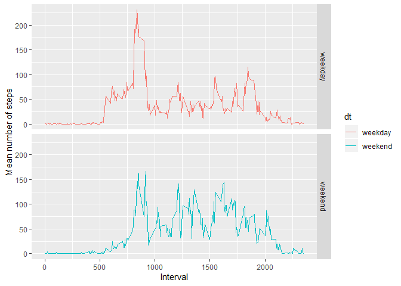

### Load and preprocess data

Load data

    data <- read.csv("./Data/activity.csv", header = TRUE)
    data$date <- as.Date(data$date,"%Y-%m-%d")

### Mean total number of steps taken per day

Calculate the total number of steps taken per day.

    sumSteps <- aggregate(data$steps, by=list(d = data$date),FUN=sum)

Plot the number of steps per day as a histogram.

    hist(sumSteps$x,xlab="Number of steps", ylab="Number of days",main="Total number of steps per day")

Calculate the mean and median total number of steps taken per day.

    mean(sumSteps$x,na.rm=TRUE)

    ## [1] 10766.19

    median(sumSteps$x,na.rm=TRUE)

    ## [1] 10765

### Average daily activity pattern

Make a time series plot of the 5-minute interval (x-axis) and the
average number of steps taken, averaged across all days (y-axis).

    avgIntervals <- aggregate(data$steps,by=list(interval = data$interval),FUN=mean, na.rm=TRUE)

    plot(avgIntervals$interval,avgIntervals$x,type="l")

Which 5-minute interval, on average across all the days in the dataset,
contains the maximum number of steps?

    avgIntervals[avgIntervals$x==max(avgIntervals$x),]$interval

    ## [1] 835

### Imputing missing values

Calculate and report the total number of missing values in the dataset
(i.e. the total number of rows with NAs)

    sum(is.na(data$steps))

    ## [1] 2304

Missing values filled with mean for that 5-minute interval over entire
month of data.

    missingIntervals <- data[is.na(data$steps),'interval']

    dataNAfill <- data
    dataNAfill[is.na(data$steps),'steps'] = unlist(lapply(missingIntervals,function(x) avgIntervals[avgIntervals$interval == x,'x']))

    sumStepsNA <- aggregate(dataNAfill$steps, by=list(d = dataNAfill$date),FUN=sum)

Make a histogram of the total number of steps taken each day and
Calculate and report the mean and median total number of steps taken per
day.

    hist(sumStepsNA$x,xlab="Number of steps", ylab="Number of days",main="Total number of steps per day")

Calculate the mean and median total number of steps taken per day with
NA values filled in.

    mean(sumStepsNA$x)

    ## [1] 10766.19

    median(sumStepsNA$x)

    ## [1] 10766.19

### Differences in weekdays versus weekends

Create a new factor variable in the dataset with two levels – “weekday”
and “weekend” indicating whether a given date is a weekday or weekend
day.

    dataNAfill$daytype <- unlist(lapply(weekdays(dataNAfill$date),function(x) ifelse(x == "Saturday" | x == "Sunday","weekend","weekday")))

Make a panel plot containing a time series plot (i.e. type = “l”) of the
5-minute interval (x-axis) and the average number of steps taken,
averaged across all weekday days or weekend days (y-axis).

    weekdayMean <- aggregate(dataNAfill$steps, by=list(interval = dataNAfill$interval,dt= dataNAfill$daytype),FUN=mean)

    library(ggplot2)
    p <- ggplot(weekdayMean,aes(x=interval,y=x, col=dt)) + geom_line()
    p + facet_grid(dt~.) + xlab("Interval") + ylab("Mean number of steps") + guides(fill=FALSE)

